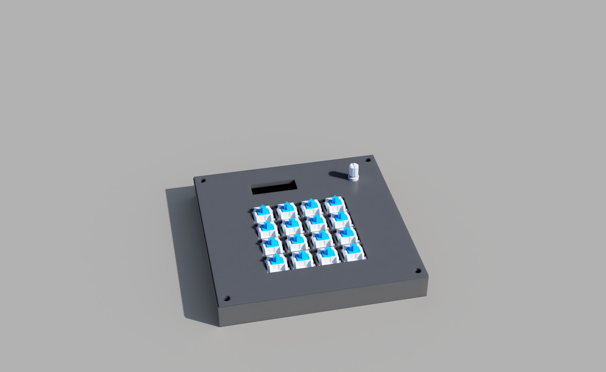
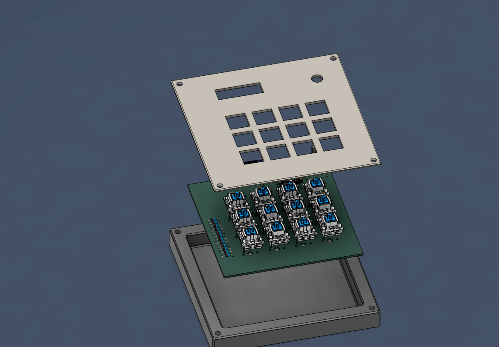
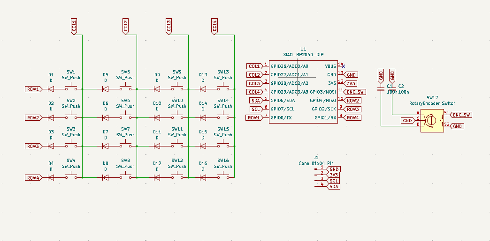
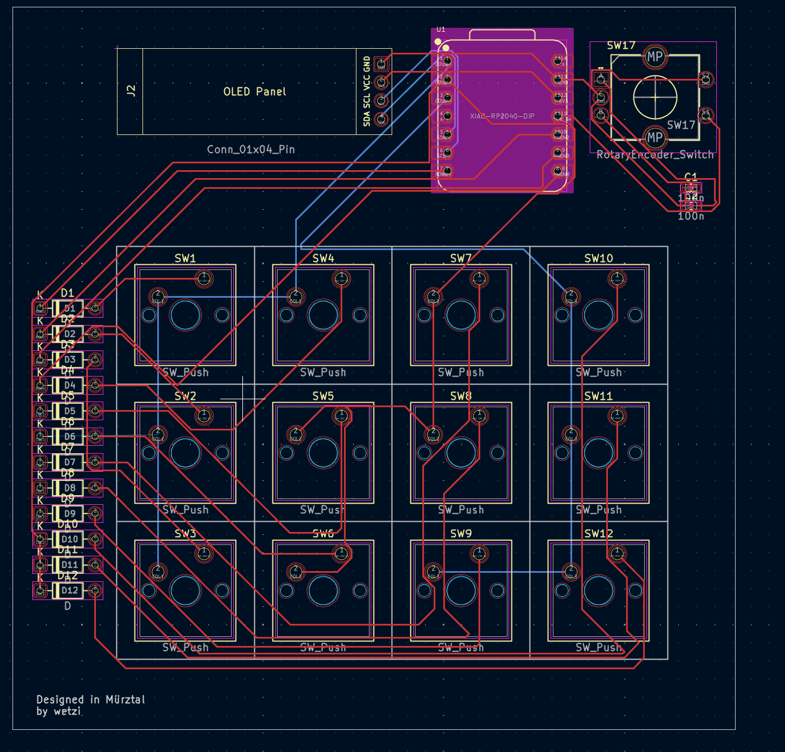
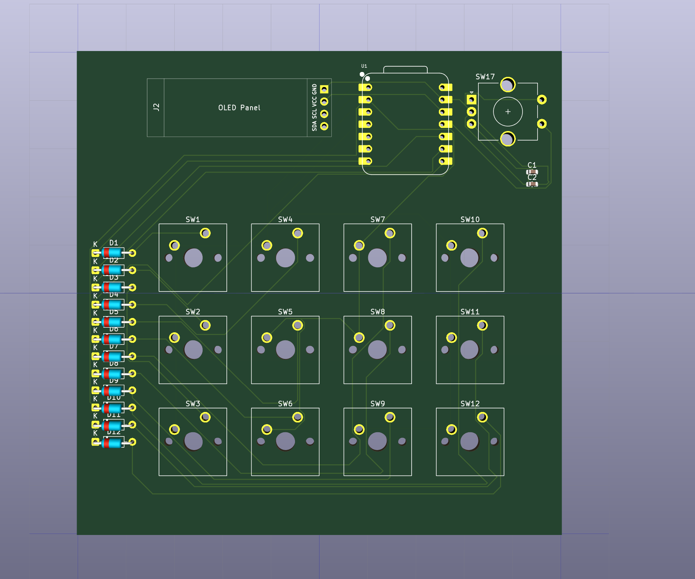
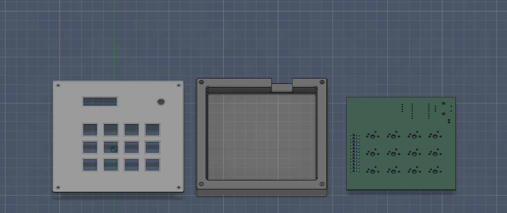

# Hackpad V1
This is my first real try for the **Hack Club Blueprint** challenge! I wanted to build something functional and learn the full process from PCB design to 3D modeling.
**This project was guided by the Hackpad Guide**

## 1. The Idea
My goal was to create a clean and simple macro pad with the following features:
* **16 Mechanical Switches:** A full 4x4 matrix for maximum input options.
* **OLED Display:** A 0.91" screen to show status or a clock.
* **Rotary Encoder:** An EC11 knob for volume control or scrolling.
* **Simplicity:** Keeping the design beginner-friendly but powerful.

### Bill of Materials (BOM)
To build this, I am using the following components:
* **12x** 1N4148 Diodes (Through-hole).
* **12x** MX-Style Switches (Kailh Polia).
* **1x** EC11 Rotary Encoder.
* **2x** 100nF Ceramic Capacitors.
* **1x** 0.91-inch OLED Display (SSD1306).
* **12x** White Blank DSA Keycaps.
* **1x** Seeed Studio XIAO RP2040 Controller.

### Use Case
I will use it as a custom **Small Numpad**. The OLED screen will act as a system monitor or a simple clock to keep track of time while working or just to watch cool animations.

---

## 2. Schematic & Electronics
I designed the circuit to be reliable and easy to solder. It uses a row-column matrix to handle all 16 switches with the limited pins of the XIAO.

 **Important to know** 
The Rotary Encoder Switch just works to mute and unmute the Capacitor just there as backup!
I would work without the Capacitors but for me its okay.

---

## 3. PCB Design
This is the heart of the Hackpad. I routed everything carefully to fit the 4x4 grid and the extra components like the encoder and OLED.

---

## 4. 3D Modeling & Case
This was my first time 3D modeling anything! I used **Fusion 360** for the case design to ensure everything fits perfectly.

### KiCad 3D Preview
First, I checked the component placement in KiCad's 3D viewer.

### Fusion 360 Implementation
I exported the PCB as a `.step` file and imported it into Fusion 360 to build the case around it.
* **PCB Size:** 100mm x 100mm – a perfect size for a beginner like me.
* **Case Interior:** 100.5mm x 100.5mm to ensure a snug fit for the PCB.
* **Case Exterior:** 120mm x 120mm total width.
* **Switch Cutouts:** 14.2mm x 14.2mm for easy snapping of the MX switches.
* **Dimensions:** 12mm total height with a 3mm thick floor for stability.

> **Note:** The top plate might need some light sanding for a perfect fit, but I can handle these tolerances during assembly!

---

## 5. Firmware

The Crash Pad runs on **KMK Firmware** (CircuitPython).

* **Layout:** A standard Numpad layout (0–9, Backspace, Enter)
* **OLED:** Displays a custom logo and device name on a 128x32 SSD1306 display
* **Encoder:** Programmed as a System Mute toggle (works in all applications)

> **I am currently learning Python. This firmware was assisted by AI,
> but my own version is coming soon!**