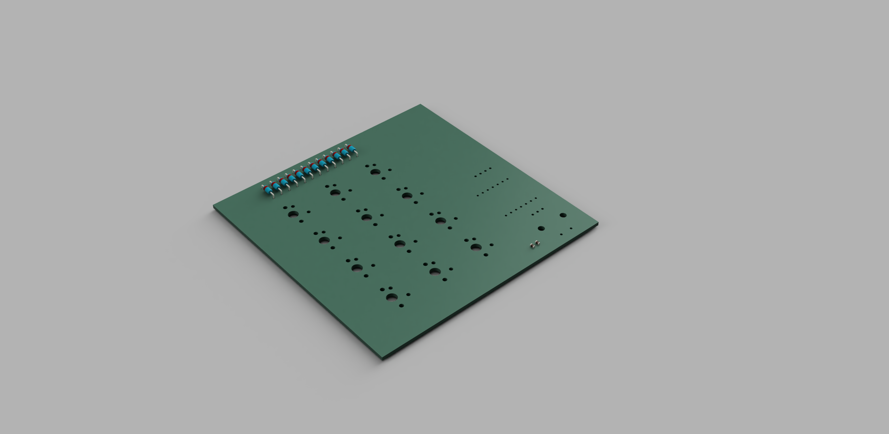

# Hackpad
This is my first real Try for HackClub Blueprint challange

## 1. I made my Idea 
### My Idea
- It should have 16 switches
- An Oled Screen
- Rotary potentiometer
- It should be Simple 

## 2. I made my formwork plan

## 3. Connect on PCB

## 4. 3D - Modeling

### View in KiCad 3D-View

This is my first time to 3D model something. For this project i use `Fusion 360`.
I export it as a .step file and opend it in Fusion 360. 
-My PCB Design is 100mm x 100mm its perfect to design for beginners like me (I think)

### View in Fusion 360
This is my first view.

